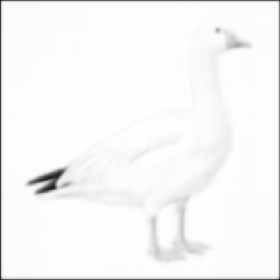
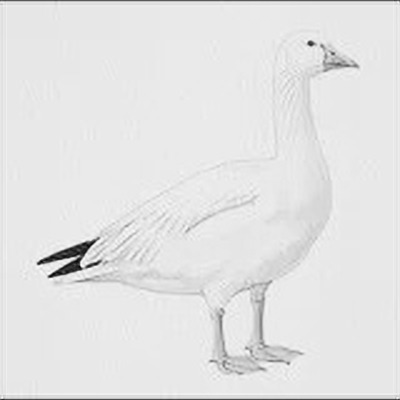

# SRCNN
PyTorch implementation of [Super Resolution Convolutional Neural Network](https://arxiv.org/abs/1501.00092v3). Image Super-Resolution Using Deep Convolutional Networks by Dong et al.  
Data in `t91-image-data/sris_srcnn_data/` is a modified version of [this](https://www.kaggle.com/ll01dm/t91-image-dataset) dataset.

## Qualitative results
|  LR Image (Bilinear Interpolation)| HR Image (SRCNN Generated)      |
|:----------:|:-------------:|
|||
---
